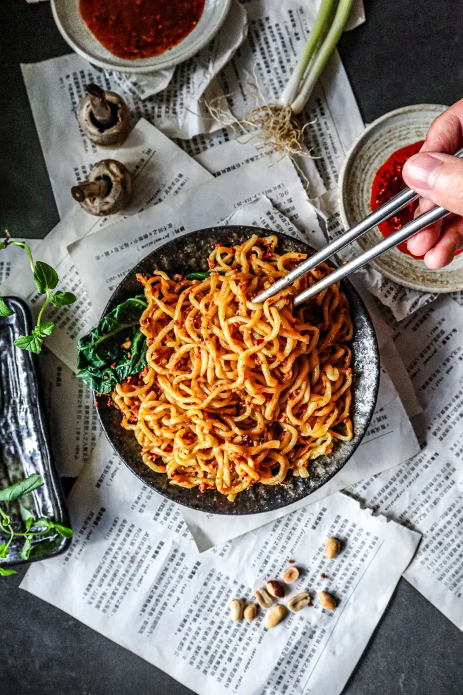

+++
authors = ["Max Gallup"]
title = "Dan Dan Noodles"
description = "Quick & easy, thick & spicy, garlic heavy."
date = 2024-04-01

[taxonomies]
tags = ["spicy", "saucy", "hearty", "quick"]
+++

### Ingredients
* 4x cloves of garlic, grated
* 2x tablespoons chili flakes
* 1x tablespoon sesame seeds
* 2x teaspoons ground Sichuan pepper
* 4x tablespoons vegetable oil (heated in pan)
* 4x tablespoons soy sauce
* 2x tablespoons dark brown sugar
* 1.5x tablespoons peanut butter or sesame paste
* 2x teaspoons black vinegar

### Instructions
Combine all ingredients except for the soy sauce, peanut butter and oil into a bowl. Heat oil in a pan until hot and pour over ingredients. Mix, then add the remaining peanut butter and soy sauce. Consistency should be rather thick. Splash of hot noodle-water can be added when serving.

> Credit: [Chez Jorge](https://chejorge.com/2020/07/24/vegan-dan-dan-noodles/)

